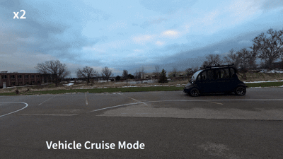
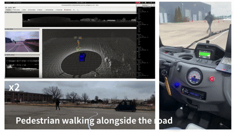
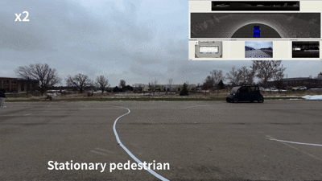
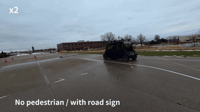

# AutoShield: Real-Time Pedestrian-Intent Prediction with Safety-Filtered Autonomous Driving


> **A modular ROS 2 autonomy stack deployed on the UIUC GEM vehicle that adapts driving behavior using pedestrian motion cues and time-to-collision (TTC) risk estimation — combining LiDAR + RGB-D perception, weighted sensor fusion, behavior prediction, a safety state machine, and Stanley/PID control with emergency braking override.**

---


---

## Team

**Team AutoShield** — M.S. Autonomy and Robotics, UIUC
- Sunny Deshpande · Het Patel · Keisuke Ogawa · Ansh Bhansali

---

## Overview

Reactive pedestrian handling that relies on proximity thresholds and late braking is brittle under uncertainty, latency, and partial observability. AutoShield addresses this by adapting vehicle control **online using behavior cues and TTC risk**, rather than distance thresholds alone.

The full stack cleanly separates perception, prediction, planning, and control as ROS 2 nodes connected by typed topics:

```
LiDAR ──┐
        ├──► Sensor Fusion ──► Pedestrian Behavior Prediction ──► High-Level Decision ──► Safety Controller ──► Controller
RGB-D ──┘                                                                                        ▲
                                                                                          GNSS Localization
```

---

## Hardware Platform — UIUC GEM

| Sensor | Spec |
|---|---|
| **Top LiDAR** | Ouster OS1-128 — 128ch, 360° HFoV, 45° VFoV, 10–20 Hz, ~200m range |
| **Front LiDAR** | Livox HAP — 120°×25° FoV, ~452k pts/s |
| **Front Stereo RGB-D** | OAK-D LR — 1280×800 @ 23 FPS, global shutter |
| **Corner Cameras** | Lucid — 1920×1200 @ 48.3 FPS, PoE |
| **GNSS/INS** | Septentrio AsteRx SBi3 Pro+ with RTK |
| **Radar** | Smartmicro 152 4D — relative speed measurements |
| **Drive-by-wire** | PACMod2 via USB-to-CAN (steering, throttle, brake) |

---

## Demo

**Baseline — no pedestrian interaction**

<table>
  <tr>
    <td align="center"><br/><em>CRUISE mode — normal autonomous operation on pre-planned path</em></td>
    <td align="center"><br/><em>Stanley controller — lateral path tracking</em></td>
  </tr>
</table>

**Pedestrian detection & response**

<table>
  <tr>
    <td align="center"><br/><em>Pedestrian walking alongside road — LiDAR tracking active</em></td>
    <td align="center"><br/><em>Stationary pedestrian — SLOW_CAUTION triggered</em></td>
  </tr>
</table>

<table>
  <tr>
    <td align="center"><br/><em>Pedestrian crossing road (case 1) — STOP_YIELD triggered</em></td>
    <td align="center"><br/><em>Pedestrian crossing road (case 2) — STOP_YIELD triggered</em></td>
  </tr>
</table>

**Sign detection**

<table>
  <tr>
    <td align="center"><br/><em>Walking pedestrian + road sign — sign context enforces STOP_YIELD</em></td>
    <td align="center"><br/><em>Road sign only, no pedestrian — sign-triggered STOP_YIELD</em></td>
  </tr>
</table>

---

## System Architecture

### ROS 2 Topic Interfaces

| Topic | Type | Description |
|---|---|---|
| `/lidar_pedestrian_position` | `Int32MultiArray [d, θ]` | LiDAR pedestrian estimate |
| `/rgbd_pedestrian_position` | `Int32MultiArray [d, θ]` | RGB-D pedestrian estimate |
| `/pedestrian_sign_present` | `Bool` | Regulatory sign detected |
| `/fusion_pedestrian_position` | `Int32MultiArray [d, θ]` | Fused estimate |
| `/pedestrian_motion` | `Twist` | Predicted pedestrian motion |
| `/pedestrian_ttc` | `Float64` | TTC risk estimate (seconds) |

---

## Module Details

### 1. LiDAR Pedestrian Pipeline

Converts raw `PointCloud2` into a stable pedestrian estimate in the ego frame:

1. **Preprocessing** — voxelization, ground filtering, outlier removal
2. **Clustering** — DBSCAN to separate static/dynamic objects
3. **Tracking** — nearest-centroid matching with EMA smoothing: `c̄ₜ = αcₜ + (1−α)c̄ₜ₋₁`
4. **Human Detection** — geometric + motion filtering, distance-based candidate selection

Publishes `(d, θ)` in ego frame to `/lidar_pedestrian_position`.

---

### 2. RGB-D Pedestrian Pipeline

1. **Detection** — YOLOv11 detects pedestrian bounding boxes in RGB
2. **Depth Extraction** — maps bounding box to depth to estimate closest pedestrian range
3. **Pose Transform** — pixel + depth → ego-frame `(distance, bearing)`
4. **Sign Detection** — produces `/pedestrian_sign_present` for downstream decision logic

---

### 3. Sensor Fusion

Combines LiDAR and RGB-D into a single robust estimate with weighted fusion:

| Quantity | LiDAR Weight | Camera Weight |
|---|---|---|
| Distance | 0.8 | 0.2 |
| Direction | 0.3 | 0.7 |

- **Time sync**: approximate sync with slop ≤ 0.1s between modalities
- **Data association**: Euclidean match threshold 2.0m
- **Fallback**: unmatched detections published standalone for monitoring

---

### 4. Pedestrian Behavior Prediction & TTC

Consumes fused position history and outputs motion + TTC signals:

- **Trajectory Buffer** — bounded history of pedestrian positions
- **Trajectory Smoothing** — mitigates jitter from intermittent detections
- **Motion Prediction** — estimates pedestrian velocity and near-horizon trajectory
- **Ego Motion Prediction** — predicts future vehicle position at constant speed along +x
- **TTC Estimation** — discrete forward simulation; TTC = earliest time step where pedestrian trajectory enters collision radius `r` around ego rollout

---

### 5. High-Level Safety State Machine

Gates vehicle behavior based on TTC risk, sign context, and pedestrian dynamics:

| State | Condition | Target Speed |
|---|---|---|
| **CRUISE** | Path clear, no risk | 5.0 m/s |
| **SLOW_CAUTION** | Static pedestrian near path | 2.5 m/s |
| **STOP_YIELD** | TTC < 2.5s, sign present, or dynamic crossing | 0 m/s |

**Decision logic:**
- Data stale (>0.5s) → **STOP_YIELD** (fail-safe)
- 0 < TTC < 2.5s → **STOP_YIELD**
- Regulatory sign detected → **STOP_YIELD**
- Pedestrian near path, speed < 0.1 m/s → **SLOW_CAUTION**
- Pedestrian crossing dynamically → **STOP_YIELD**
- Path clear (after 2.0s recovery buffer) → **CRUISE**

---

### 6. Control

- **Lateral**: Stanley controller — minimizes heading error and cross-track error to follow pre-planned path
- **Longitudinal**: PID velocity controller outputs throttle/brake based on safety state speed target
- **Emergency override**: hard-brake command (magnitude ≈ 0.6) triggered on STOP_YIELD danger condition
- **Actuation**: PACMod2 drive-by-wire (steering, throttle, brake)

---

## Installation & Launch

```bash
# Build workspace
cd <ros2_ws>
bash install/smart_extract.sh  # run before build
colcon build --symlink-install

# Launch sensor stack
source install/setup.bash
ros2 launch basic_launch sensor_init.launch.py

# Launch corner cameras
source install/setup.bash
ros2 launch basic_launch corner_cameras.launch.py

# Launch GNSS / visualization
source install/setup.bash
ros2 launch basic_launch visualization.launch.py

# Launch joystick control (manual override)
source install/setup.bash
ros2 launch basic_launch dbw_joystick.launch.py

# Launch autonomous path tracking (close joystick first)
source install/setup.bash
ros2 launch pacmod2 pacmod2.launch.xml
ros2 run gem_gnss_control pure_pursuit
```

> **Safety note**: All operation requires a safety driver. Physical interlocks (emergency button + brake-pedal button) sever the PACMod connection. STOP_YIELD gates control commands — it does not automatically apply brakes. The safety driver retains final stopping authority.

---

## Project Structure

```
AutoShield/
├── src/                        # ROS 2 package source
│   ├── perception/
│   │   ├── lidar_pedestrian.py # DBSCAN clustering, EMA tracking
│   │   └── rgbd_pedestrian.py  # YOLOv11 detection + depth estimation
│   ├── fusion/
│   │   └── sensor_fusion.py    # weighted fusion with time sync + association
│   ├── prediction/
│   │   └── behavior_predictor.py # TTC estimation, trajectory smoothing
│   ├── decision/
│   │   └── safety_state_machine.py # CRUISE / SLOW_CAUTION / STOP_YIELD
│   └── control/
│       └── controller.py       # Stanley steering + PID speed + hard-brake
├── install/                    # build/install scripts
├── log/                        # runtime logs
├── reading/                    # reference papers and documentation
└── README.md
```

---

## Key Parameters

| Parameter | Value |
|---|---|
| Time sync slop | 0.1s |
| Association threshold | 2.0m |
| TTC critical range | 0 < TTC < 2.5s |
| Static pedestrian threshold | < 0.1 m/s |
| Data stale timeout | 0.5s |
| Recovery wait buffer | 2.0s |
| Hard-brake magnitude | 0.6 |
| EMA smoothing factor α | tunable |

---

## Limitations

- **Heuristic thresholds** — TTC critical range and state transitions require environment-specific tuning
- **Partial observability** — occlusions and sparse depth returns can temporarily destabilize estimates; EMA smoothing mitigates but does not eliminate this
- **Intent ambiguity** — a pedestrian near the path is not always a crossing intent; richer learned intent models could reduce false slowdowns
- **Actuation boundary** — emergency interlocks sever autonomy but do not apply brakes; hard safety guarantees require a safety driver

---

## Acknowledgments

ECE 484 course staff and the UIUC GEM platform maintainers for vehicle infrastructure, ROS drivers, and safety procedures.

---

## Author

**Sunny Deshpande** — MEng Autonomy & Robotics, UIUC  
[sunnynd2@illinois.edu](mailto:sunnynd2@illinois.edu) · [sunnydeshpande.com](https://sunnydeshpande.com)

---

*Built on ROS 2, deployed on the UIUC GEM platform*
